# CollabCanvas - System Diagrams

This document contains mermaid diagrams visualizing the CollabCanvas system architecture, flows, and timelines based on the PRD.

## Table of Contents
1. [Project Timeline](#project-timeline)
2. [System Architecture](#system-architecture)
3. [Data Flow Diagram](#data-flow-diagram)
4. [Authentication Flow](#authentication-flow)
5. [Real-Time Sync Flow](#real-time-sync-flow)
6. [Component Architecture](#component-architecture)
7. [Database Schema](#database-schema)

---

## Project Timeline

---

## System Architecture

---

## Data Flow Diagram

---

## Authentication Flow

---

## Real-Time Sync Flow

---

## Component Architecture

---

## Database Schema

---

## MVP Features Mindmap

---

## Phase 2 & 3 Roadmap

---

## User Journey Flow

---

## Performance Requirements

---

## AI Integration Architecture (Phase 3)

---

## Deployment Architecture

---

## State Management Flow

---

## MVP Success Criteria Checklist

```mermaid
graph TD
    Start{MVP Complete?}
    
    C1[✅ Deployed &<br/>Accessible]
    C2[✅ Authentication<br/>Working]
    C3[✅ Pan & Zoom<br/>Functional]
    C4[✅ Shapes Created<br/>& Moved]
    C5[✅ Real-Time<br/>Sync <100ms]
    C6[✅ Multiplayer<br/>Cursors <50ms]
    C7[✅ Online Users<br/>List]
    C8[✅ State<br/>Persists]
    
    Success[🎉 MVP COMPLETE!]
    Fail[❌ More Work Needed]
    
    Start --> C1
    Start --> C2
    Start --> C3
    Start --> C4
    Start --> C5
    Start --> C6
    Start --> C7
    Start --> C8
    
    C1 & C2 & C3 & C4 & C5 & C6 & C7 & C8 --> Success
    C1 -.->|Any Missing| Fail
    
    style Success fill:#10B981,color:#fff
    style Fail fill:#EF4444,color:#fff
```

---

## How to View These Diagrams

These mermaid diagrams can be viewed in:

1. **GitHub** - Automatically renders mermaid in markdown
2. **VS Code** - Use "Markdown Preview Enhanced" extension
3. **Online** - Copy to [mermaid.live](https://mermaid.live) editor
4. **Documentation sites** - Most markdown renderers support mermaid

## Diagram Legend

- **Blue** (#4F46E5) - Frontend/UI components
- **Orange** (#FFA000) - Firebase/Backend services  
- **Green** (#10B981) - AI/Success states
- **Red** (#EF4444) - Error/Failure states

---

Generated from CollabCanvas PRD - See [collabcanvas_prd.md](./collabcanvas_prd.md) for detailed requirements.

